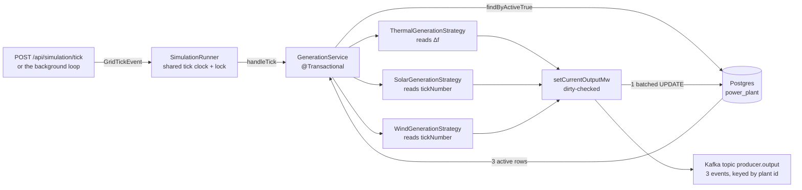

# Anatomy of a Tick

How the Producer service turns one tick into megawatts on a Kafka topic.

All figures below are real output from the running service on port 8090, cross-checked against the
strategy classes computed directly.

---

## 1. "Power per second" is a question the units answer first

The simulation does **not** produce power per second. A watt *is* a rate — one joule every second —
so a megawatt already carries the "per second" inside it:

```
1 MW   =  1 000 000 J/s   =  power,  an instantaneous rate
1 MWh  =  1 MW x 1 hour   =  energy, a quantity that accumulates
```

Asking for power per second asks for joules per second per second, which is not a thing a power
station has.

What a tick emits is a **sample of instantaneous power**, one per plant. To get energy, multiply by
how long that power was held:

```
tick 0 fleet output ......... 520.2 MW
one tick covers ............. 5 simulated minutes
energy moved that tick ...... 520.2 x 5/60 = 43.4 MWh
```

---

## 2. Two clocks, running at different speeds

This is what makes "per second" ambiguous here. A tick is *paced* by one clock but *means*
something on another.

| Clock | Set by | Value | What it controls |
|---|---|---|---|
| **Wall clock** | `producer.simulation.tick-interval` | 5 s | How fast you watch. Changing it does not change what is computed. |
| **Simulation clock** | `TICKS_PER_DAY = 288` in `SolarGenerationStrategy` | 5 simulated min | What the strategies think the time of day is. |
| **Ratio** | — | **60x faster** | A simulated day passes in 24 minutes of real time. |

```
REAL TIME       │────5s────│────5s────│────5s────│────5s────│────5s────│
                ▼          ▼          ▼          ▼          ▼          ▼
                t=0        t=1        t=2        t=3        t=4        t=5
                ▲          ▲          ▲          ▲          ▲          ▲
SIMULATED TIME  │──5 min───│──5 min───│──5 min───│──5 min───│──5 min───│
```

Neither clock is "seconds of generation". Sunrise lands on tick 72 because 72/288 of a day is 06:00.

---

## 3. What one tick actually does

One database read, three in-memory calculations, one batched write-back, three Kafka publishes.
Nothing else touches Postgres.



The strategies are stateless singletons, indexed into a `Map<PlantType, GenerationStrategy>` at
startup. They never mutate the plant — `GenerationService` owns the write-back.

The fourth plant in the table, `Decommissioned Unit 9`, is `active = false`. It is dropped at the
read by `findByActiveTrue()`, which is why a tick publishes **three** events, not four.

---

## 4. Where the megawatts come from

Each technology answers a different question. **Only the thermal unit responds to the grid.** The
two renewables are non-dispatchable and read the clock instead — which is not a modelling shortcut,
it is why a grid with more renewables has less frequency response available.

### Thermal — Ratnagiri Unit 1, 500 MW

```
response = -(Δf / 50) / 0.04 x capacity
output   = clamp(base + response, min, capacity)
```

Governor speed-droop at `R = 4%`. Frequency below nominal means the grid is short, so the governor
opens up — output moves **opposite** to the deviation. Works out to a flat **250 MW per Hz**.

### Solar — Bhadla Solar Park, 200 MW

```
d         = (tick mod 288) / 288
elevation = sin(π (d - 0.25) / 0.5)
output    = capacity x max(0, elevation) x cloud      cloud ∈ [0.70, 1.00]
```

A half-sine standing in for solar elevation, clamped to zero outside the 06:00–18:00 window, then
scaled down by cloud cover. Inverter-coupled, so no governor and no contribution to frequency
response.

### Wind — Muppandal Wind Farm, 150 MW

```
front  = sine, period 2003 ticks      (slow weather front)
gust   = sine, period 37 ticks        (fast gusts)
cf     = 0.70·front + 0.20·gust + 0.10·noise
output = capacity x clamp(cf, 0.05, 0.95)
```

Two sines at deliberately coprime periods, so the pattern never repeats on a daily cycle. Clamped
well short of nameplate, as real turbines are.

### What each strategy reads

| Input | Thermal | Solar | Wind |
|---|:---:|:---:|:---:|
| `frequencyDeviation` | **yes** | no | no |
| `tickNumber` | no | **yes** | **yes** |
| `capacityMw` | **yes** | **yes** | **yes** |
| `baseOutputMw` | **yes** | no | no |
| `minOutputMw` | **yes** | no | no |

That table is why the seeded renewables carry a zero setpoint: nothing ever reads it.

---

## 5. One simulated day — 288 ticks

Run over a full day at zero frequency deviation. Thermal holds its setpoint flat, wind wanders,
and solar is the entire difference between a 458 MW night and a 692 MW afternoon.

```
  █ thermal (Ratnagiri)   ▓ wind (Muppandal)   ░ solar (Bhadla)      1 char ≈ 20 MW

00:00  tick   0  ████████████████████▓▓▓▓▓▓             520.2 MW
02:00  tick  24  ████████████████████▓▓▓▓▓▓             512.0 MW
04:00  tick  48  ████████████████████▓▓▓▓▓              494.2 MW
06:00  tick  72  ████████████████████▓▓▓▓▓▓             520.9 MW   ← sunrise
08:00  tick  96  ████████████████████▓▓▓▓▓░░░░          571.9 MW
10:00  tick 120  ████████████████████▓▓▓▓░░░░░░░░       644.2 MW
11:30  tick 138  ████████████████████▓▓▓▓▓░░░░░░░░░░    691.9 MW   ← solar peak
12:00  tick 144  ████████████████████▓▓▓▓▓▓░░░░░░░░     670.1 MW
14:00  tick 168  ████████████████████▓▓▓▓░░░░░░         609.5 MW
16:00  tick 192  ████████████████████▓▓▓▓░░░░░          576.0 MW
18:00  tick 216  ████████████████████▓▓▓▓               488.7 MW   ← sunset
20:00  tick 240  ████████████████████▓▓▓                457.9 MW
22:00  tick 264  ████████████████████▓▓▓▓               477.1 MW
24:00  tick 288  ████████████████████▓▓▓▓               482.1 MW
                 └──── never moves ───┘
```

Solar is zero for two thirds of the ticks. **A tick fired at night reports a smaller fleet total
with nothing wrong** — that is the single most common way to misread this output.

---

## 6. The one input that changes anything

`frequencyDeviation` is the only field in a `GridTickEvent` that any plant can respond to, and only
thermal reads it. The line is dead straight, because droop is deliberately proportional-only —
integral action would make units fight each other. Restoring nominal frequency is secondary control
(AGC), which belongs to the Grid service, not here.

```
                  below setpoint ◀  │  ▶ above setpoint         output      1 char = 4 MW

 -0.25 Hz                          ████████████████            462.5 MW
 -0.20 Hz                          ████████████                450.0 MW
 -0.10 Hz                          ██████                      425.0 MW   ← verified live
 -0.05 Hz                          ███                         412.5 MW
  0.00 Hz                          ·                           400.0 MW   ← setpoint held
 +0.05 Hz                       ███                            387.5 MW
 +0.10 Hz                    ██████                            375.0 MW
 +0.20 Hz              ████████████                            350.0 MW
 +0.25 Hz          ████████████████                            337.5 MW
```

**Negative deviation means the grid is running slow, so the unit generates more.** If output ever
drops on a negative deviation, the sign convention has been broken.

Response scales with rated capacity, so a 500 MW unit contributes five times the MW of a 100 MW unit
at the same droop setting. That is what makes load sharing proportional rather than a race.

---

## 7. Two real ticks, side by side

Actual responses from the running service. Tick 1 ran at nominal frequency; tick 2 ran 0.1 Hz slow.

| Plant | Type | Capacity | Tick 1 · Δf 0.0 | Tick 2 · Δf −0.1 | Change |
|---|---|---:|---:|---:|---:|
| Ratnagiri Thermal Unit 1 | THERMAL | 500.0 MW | 400.00 MW | 425.00 MW | **+25.00** |
| Bhadla Solar Park | SOLAR | 200.0 MW | 0.00 MW | 0.00 MW | — |
| Muppandal Wind Farm | WIND | 150.0 MW | 113.90 MW | 120.14 MW | +6.24 |
| **Fleet total** | 3 active | 850.0 MW | **513.90 MW** | **545.14 MW** | **+31.24** |

Three things this table shows that the code alone does not:

**Wind moved too, and not because of the frequency.** It moved because the tick number advanced from
1 to 2, stepping the gust sine and the noise stream. That is the tell that wind reads the clock, not
the grid.

**Solar stayed at zero in both.** Tick 1 and 2 are just after midnight.

**Replaying a tick reproduces it exactly.** The noise is a SplitMix64 finalizer keyed on
`(plantId, tickNumber)`, not `Math.random()`. Recomputing tick 1 gives `113.90340820632204` — the
same digits, to the last decimal place, that the live API returned.

---

## 8. Driving it

```bash
curl -s -X POST http://localhost:8090/api/simulation/tick -H "Content-Type: application/json" -d "{\"frequencyDeviation\":-0.1}"
```

```bash
curl -s -X POST http://localhost:8090/api/simulation/start -H "Content-Type: application/json" -d "{\"tickInterval\":\"PT2S\"}"
```

```bash
curl -s http://localhost:8090/api/simulation/status
```

```bash
curl -s "http://localhost:8090/api/plants?activeOnly=true"
```

A tick number can be supplied explicitly to replay a specific moment. Because the strategies derive
their noise from it, the same tick number and deviation give byte-identical output every time —
an explicit replay never rewinds the shared clock.
